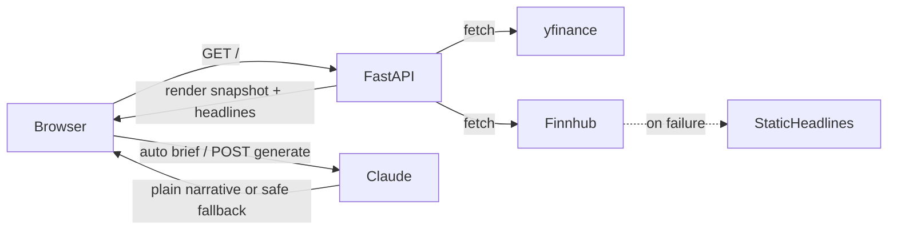

# Master Context — Wealth Morning Brief
**Date:** 2026-07-13  
**Purpose:** Bootstrap snapshot after agent-infra setup (pre full V1 implement)

---

## 1. Architecture Overview

Wealth Morning Brief is an OCBC AI Lab interview prototype: a single-page FastAPI app that shows a live (or last-close) market snapshot, financial headlines, and a Claude-generated morning narrative. V2 adds a client persona form so the same numbers produce differently framed briefs.

**Stack:** FastAPI · Jinja2 · HTMX · yfinance · Finnhub · Anthropic Claude · Railway (paid)

**Layout:** Specs and agent docs at repo root / `tasks/`; runnable app in `wealth-brief/`.

**Design constraints:** Snapshot never blocked by LLM/news failures; OCBC red/white UI (no navy, no OCBC logo); secrets only via env; no hard Claude max-token cap.

---

## 2. Data Flow

---

## 3. File Map

| Path | Role |
|------|------|
| `AGENTS.md` | Agent workflows, stack, skills |
| `JOURNAL.md` / `LEARNINGS.md` / `CONCEPTS.md` | Engineering log, errors, glossary |
| `tasks/0001-prd-…` | Product requirements |
| `tasks/tasks-0001-…` | Implementation task list |
| `wealth-brief/` | Application (partial scaffold present) |
| `docs/solutions/` | Compound learnings store |
| `.compound/` | Schema + frontmatter validator |
| `Prompts/` | Carson PRD / tasks / process prompts |
| `context/` | Dated architecture snapshots |

**Expected app files (per task list):** `main.py`, `data/market.py`, `data/fallback_headlines.py`, `llm/brief.py`, `templates/`, `static/`, `tests/`, `Procfile`, `.env.example`

---

## 4. Bug Reports (harvested)

1. **Jinja template 500 on first uvicorn smoke (2026-07-13):** Early scaffold returned HTTP 500 on `GET /` until template path/config was fixed; restart then returned 200. Source: aborted terminal sessions `504764` / `504765`.
2. **Incomplete scaffold / deleted tracked files (2026-07-13):** `git status` showed many `wealth-brief/` paths as deleted (`main.py`, `market.py`, templates, tests, Procfile, `.env.example`) while empty package dirs and `requirements.txt` remain — treat app as **partial / inconsistent** until task list rebuilds V1 cleanly.
3. **Agent infra gap (resolved 2026-07-13):** Repo had a pasted Aircraft Safety Tracker `AGENTS.md` without JOURNAL/LEARNINGS/context/compound — blocked compliant autonomous implementation until this bootstrap.

---

## 5. Relevant Snippets / Conventions

- Run pytest and uvicorn from `wealth-brief/`.
- Safe LLM user message pattern: catch Anthropic errors → fixed string; log server-side.
- Finnhub fallback: curated static headlines ≤ ~1 day old.
- Persona `POST /generate`: reuse in-page snapshot; do not re-fetch yfinance by default.

---

## 6. Error Log Summary

| Area | Note |
|------|------|
| Templates | Path/mount mistakes → 500 on `/` |
| Git | Tracked wealth-brief files may be missing on disk — restore via task implementation |
| Secrets | Never commit `.env` |

---

## 7. Current implementation status

- **PRD + task list:** Ready (`tasks/`)
- **Agent infra:** Bootstrapped (this snapshot)
- **App code:** Partial scaffold only; follow `tasks/tasks-0001-prd-wealth-market-brief-generator.md` from 1.0
- **Deploy:** Not verified on Railway yet
