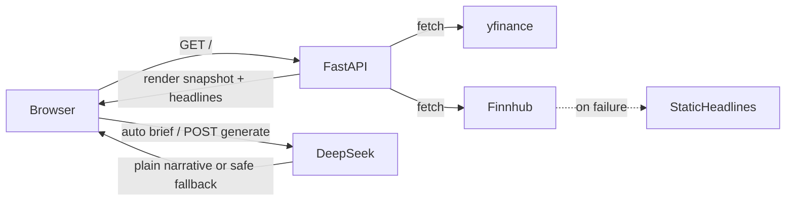

# Master Context — Wealth Morning Brief
**Date:** 2026-07-16  
**Purpose:** Refresh after DeepSeek LLM swap (context was stale >2 days)

---

## 1. Architecture Overview

Wealth Morning Brief is an OCBC AI Lab interview prototype: a single-page FastAPI app that shows a live (or last-close) market snapshot, financial headlines, and a DeepSeek-generated morning narrative. V2 adds a client persona form so the same numbers produce differently framed briefs.

**Stack:** FastAPI · Jinja2 · HTMX · yfinance · Finnhub · DeepSeek (`deepseek-chat`) · Railway (paid)

**Layout:** Specs and agent docs at repo root / `tasks/`; runnable app in `wealth-brief/`.

**Design constraints:** Snapshot never blocked by LLM/news failures; OCBC red/white UI; secrets via `DEEPSEEK_API_KEY` + optional `FINNHUB_API_KEY`.

---

## 2. Data Flow

---

## 3. File Map

| Path | Role |
|------|------|
| `wealth-brief/main.py` | FastAPI routes: `/`, `/generate`, `/market`, `/health` |
| `wealth-brief/data/market.py` | yfinance + Finnhub + fallback |
| `wealth-brief/llm/brief.py` | DeepSeek via OpenAI client |
| `tasks/0001-prd-…` / `tasks/tasks-0001-…` | PRD + task list |
| `docs/solutions/` | Compound learnings |

---

## 4. Bug Reports (harvested)

1. **Jinja template 500 on first uvicorn smoke (2026-07-13):** Fixed; later `GET /` 200.
2. **Partial wealth-brief teardown (2026-07-13):** Restored from git; V1 brief UI landed.
3. **Anthropic cost concern (2026-07-16):** Swapped LLM to DeepSeek; Railway/local env must use `DEEPSEEK_API_KEY` (not `ANTHROPIC_API_KEY`).

---

## 5. Conventions

- Run pytest/uvicorn from `wealth-brief/`.
- Graceful LLM degradation: safe user message only.
- Persona `/generate` reuses in-page snapshot JSON.

---

## 6. Implementation status

- Tasks **1.0–3.0** done; **4.1–4.2** done; **4.4 Railway** pending public URL + env vars
- V2 persona form (**5.0**) not started
- GitHub: https://github.com/elessarrr/OCBC_RM_prototype
